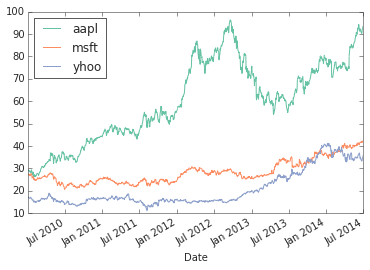

# Examples

Here are some code examples to test out the theme.

## Sub-Heading

This is a second level heading (`h2`).

### Sub-Sub-Heading

This is a third level heading (`h3`).

## Code

Here is some `inline code text` and:

    multiline
    code text

It also works with existing Sphinx highlighting:

``` html
<html>
  <body>Hello World</body>
</html>
```

``` python
def hello():
    """Greet."""
    return "Hello World"
```

``` javascript
/**
 * Greet.
 */
function hello(): {
  return "Hello World";
}
```

## Admonitions

### See Also

::: seealso
This is a **seealso**.
:::

::: seealso
This is a longer seealso. It might also contain links to our code such
as a link to
`convert_notebooks <klink.__init__.convert_notebooks>`{.interpreted-text
role="func"} and it may also simply contain a normal hyperlink to
<http://www.google.com>.
:::

### Note

::: note
::: title
Note
:::

This is a **note**.
:::

::: note
::: title
Note
:::

This is a longer note. It might also contain links to our code such as a
link to
`convert_notebooks <klink.__init__.convert_notebooks>`{.interpreted-text
role="func"} and it may also simply contain a normal hyperlink to
<http://www.google.com>.
:::

### Warning

::: warning
::: title
Warning
:::

This is a **warning**.
:::

::: warning
::: title
Warning
:::

This is a longer warning. It might also contain links to our code such
as a link to
`convert_notebooks <klink.__init__.convert_notebooks>`{.interpreted-text
role="func"} and it may also simply contain a normal hyperlink to
<http://www.google.com>.
:::

### Danger

::: danger
::: title
Danger
:::

This is **danger**-ous.
:::

::: danger
::: title
Danger
:::

This is a longer danger. It might also contain links to our code such as
a link to
`convert_notebooks <klink.__init__.convert_notebooks>`{.interpreted-text
role="func"} and it may also simply contain a normal hyperlink to
<http://www.google.com>.
:::

## Footnotes

I have footnoted a first item[^1] and second item[^2].

**Footnotes**

## Tables

Here are some examples of Sphinx
[tables](http://sphinx-doc.org/rest.html#rst-tables).

### Grid

  -----------------------------------------------------------
  Header1                  Header2      Header3    Header4
  ------------------------ ------------ ---------- ----------
  row1, cell1              cell2        cell3      cell4

  row2 \...                \...         \...       

  \...                     \...         \...       
  -----------------------------------------------------------

### Simple

  H1      H2      H3
  ------- ------- -------
  cell1   cell2   cell3
  \...    \...    \...
  \...    \...    \...

### Code Documentation

An example Python function.

> Format the exception with a traceback.
>
> param etype
>
> :   exception type
>
> param value
>
> :   exception value
>
> param tb
>
> :   traceback object
>
> param limit
>
> :   maximum number of stack frames to show
>
> type limit
>
> :   integer or None
>
> rtype
>
> :   list of strings

An example JavaScript function.

> param string name
>
> :   The name of the animal
>
> param number age
>
> :   an optional age for the animal

## IPython Notebook

This is what Notebook integration looks like:

``` 
import pandas as pd
import numpy as np
import ffn
#%pylab inline
```

``` 
print 'this is a printed line'
```

::: {.parsed-literal .pynb-result}
this is a printed line
:::

``` 
data = ffn.get('aapl,msft,yhoo', start='2010-01-01')
print data.head()
```

::: {.parsed-literal .pynb-result}
aapl msft yhoo Date 2010-01-04 29.22 27.48 17.10 2010-01-05 29.27 27.49
17.23 2010-01-06 28.81 27.32 17.17 2010-01-07 28.75 27.03 16.70
2010-01-08 28.94 27.22 16.70

\[5 rows x 3 columns\]
:::

``` 
data.head()
```

```{=html}
<div class="pynb-result" style="max-height:1000px;max-width:1500px;overflow:auto;">
<table border="1" class="dataframe">
  <thead>
    <tr style="text-align: right;">
      <th></th>
      <th>aapl</th>
      <th>msft</th>
      <th>yhoo</th>
    </tr>
    <tr>
      <th>Date</th>
      <th></th>
      <th></th>
      <th></th>
    </tr>
  </thead>
  <tbody>
    <tr>
      <th>2010-01-04</th>
      <td> 29.22</td>
      <td> 27.48</td>
      <td> 17.10</td>
    </tr>
    <tr>
      <th>2010-01-05</th>
      <td> 29.27</td>
      <td> 27.49</td>
      <td> 17.23</td>
    </tr>
    <tr>
      <th>2010-01-06</th>
      <td> 28.81</td>
      <td> 27.32</td>
      <td> 17.17</td>
    </tr>
    <tr>
      <th>2010-01-07</th>
      <td> 28.75</td>
      <td> 27.03</td>
      <td> 16.70</td>
    </tr>
    <tr>
      <th>2010-01-08</th>
      <td> 28.94</td>
      <td> 27.22</td>
      <td> 16.70</td>
    </tr>
  </tbody>
</table>
<p>5 rows × 3 columns</p>
</div>
```
``` 
data.plot()
```

::: {.parsed-literal .pynb-result}
\<matplotlib.axes.AxesSubplot at 0x7fbae88b19d0\>
:::

{.pynb .pynb}

``` 
# this is a comment
data.to_returns().dropna().corr().as_format('.2f')
```

```{=html}
<div class="pynb-result" style="max-height:1000px;max-width:1500px;overflow:auto;">
<table border="1" class="dataframe">
  <thead>
    <tr style="text-align: right;">
      <th></th>
      <th>aapl</th>
      <th>msft</th>
      <th>yhoo</th>
    </tr>
  </thead>
  <tbody>
    <tr>
      <th>aapl</th>
      <td> 1.00</td>
      <td> 0.35</td>
      <td> 0.28</td>
    </tr>
    <tr>
      <th>msft</th>
      <td> 0.35</td>
      <td> 1.00</td>
      <td> 0.37</td>
    </tr>
    <tr>
      <th>yhoo</th>
      <td> 0.28</td>
      <td> 0.37</td>
      <td> 1.00</td>
    </tr>
  </tbody>
</table>
<p>3 rows × 3 columns</p>
</div>
```

[^1]: My first footnote.

[^2]: My second footnote.
