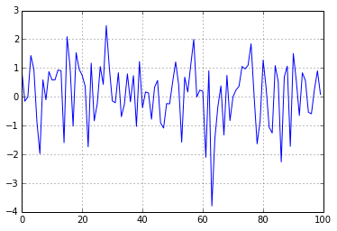

# Overview

Klink is a **simple** and **clean** theme for creating [Sphinx
docs](http://sphinx-doc.org/). It is heavily inspired by the beautiful
[jrnl theme](https://github.com/maebert/jrnl). It also supports
embedding [IPython Notebooks](http://ipython.org/notebook.html) which
can be mighty useful.

## Options

Here are the theme options. They should be added to the
html_theme_options in your **conf.py** file.

- **github**: The github address of the project. The format is name/project (pmorissette/klink).
- **logo**: The logo file. Assumed to be in the \_static dir. Default is logo.png. The logo should be 150x150.
- **analytics_id**: Your Google Analytics id (usually starts with UA-\...)

## IPython Notebook Integration

With the klink helper function `convert_notebooks()
<klink.__init__.convert_notebooks>`{.interpreted-text role="func"}, all
notebooks will be converted to .rst so that they can be included in your
docs. This includes all output including images. It's a very convenient
way to create Python docs!

All you have to do is create notebooks within your source directory
(same directory as your conf.py file). Then, you add a call to
klink.convert_notebooks() in your conf.py. You can also mix in
**Mardown** cells or **Raw NBConvert** cells in your workbook. These
will be converted to rst as well.

::: note
::: title
Note
:::

If you use the Raw NBConvert type cells, add a blank line at the start.
There seems to be a bug in the rst conversion and if the cell does not
begin with a blank line, you may run into some issues.
:::

Using a Raw NBConvert cell with rst text inside is convenient,
especially if you want to have links to other parts of your Sphinx docs.

::: danger
::: title
Danger
:::

Do not name your Notebooks with the same name as another reST file in
your source directory as the file will be **overwritten** when calling
convert_notebooks.
:::

### A Quick Example

Here is a quick example of what it looks like. I am writing this in my
notebook file by the way (using a Mardown cell).

Here is some code + output:

```
# have to comment out the magic IPython functions because of a bug
#%pylab inline
import numpy as np
import pandas as pd
```

```
print np.random.randn(20)
```

::: {.parsed-literal .pynb-result}

\[-0.81256785 -1.16630768 0.27555802 0.57729188 -0.64691411 0.62288591

:   0.27943851 0.10512695 0.23808598 -1.45293996 -0.24394825 -0.14631097
    1.56377514 -0.87629984 1.64059433 -0.10259616 0.84435183 0.11718899
    -0.66617413 -0.81800771\]
:::

```
pd.Series(np.random.randn(100)).plot()
```

::: {.parsed-literal .pynb-result}
\<matplotlib.axes.AxesSubplot at 0x7f28246381d0\>
:::

{.pynb .pynb}

## Raw NBConvert Cells

In addition to markdown cells, you may also use **Raw NBConvert** cells.
This allows you to input reST directly in your notebook. It won\'t look
as pretty in the notebook itself, but will work great for your docs.
Special reST and Sphinx markup will work within a Raw NBConvert (link,
code markup, etc.).

By the way,
`convert_notebooks <klink.__init__.convert_notebooks>`{.interpreted-text
role="func"} basically calls:

    ipython nbconvert --to rst

on all the notebooks it finds. It also handles special cases and adds
special css classes for display formatting purposes. If you plan on
using IPython Notebook integration, you will need an up-to-date version
of [pandoc](http://johnmacfarlane.net/pandoc/) for this to work
properly.

::: {.toctree hidden="" maxdepth="2"}
Overview \<index\> Installation Guide \<install\> Examples \<examples\>
API \<klink\>
:::
